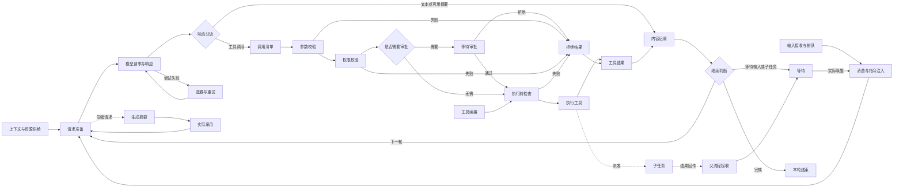

# Agent 完整运行头部与 Vue Flow 结果节点树

本文是工作台图形展示的目标契约。步骤身份与同步以[workflow 协议](../shared/protocol/workflow.md)为准；后端写者见[观察实现](../backend/service/workflow.md)。实施进度仅由[活动计划](../plan/main-agent-runtime-diagram/README.md)维护。

## 1. 当前实现与重建边界

当前纯投影已将 canonical 结果树、运行头部状态和场景组合分离，结果区不再生成 occurrence 节点。结果节点与事实边使用新版 Vue Flow 绘制；完整头部采用版本化步骤子图、条件路径、外绕回边和共享调用链。步骤分页详情、工作台固定回放、官网参照业务动效、Morphicons 状态图标、能力视觉和模型 live CRT 已完成代码级实现；真实视觉与帧率仍由活动计划 T07 实机验收。

最新决定：节点逻辑沿用当前新版继续完善，节点树用 Vue Flow 重绘，不恢复旧 Pixi 实现、旧布局算法或旧外观。结果树保留消息、工具、协作与分支等任务产物，内部步骤留在头部及步骤详情。当前卡牌模式的样式、交互、数据读取、开关与偏好保持不动。

“沿用新版逻辑”指以当前 graphModel、workflow reducer/controller、内容锚点和活动分支机制为改造基础；移除步骤混入结果树是明确的投影修正，不是回滚整套实现。既有 Nyxus 内容投影仍通过公开面复用，不重建第二份业务事实。

## 2. 产品结构

同一 Vue Flow 世界坐标和相机中，各分支的结果树向右生长，运行头部位于其生长端。完整头部解释处理过程；结果树解释任务产物。头部保留，不在结束后被整张复制到历史。

```text
较早结果节点 ──→ 新结果节点 ──→ [完整运行流程头部]
       └─派发─→ 子任务结果 ──→ [简略头部]
                     └─返回─→ 主流程实际接收位置
```

- 完整头部只属于 activeBranchId 指定的 original/continuation；其他分支、detail、各层子 Agent 为简略头部。选择不等于激活。
- 结果以 canonical timeline 实际到达为准，可在运行中逐步出现；不等待整个 run 结束才展示，也不因为某个 occurrence 完成而制造结果节点。
- 一轮结束后，已经形成的消息、工具、派发、返回和过程组留在树上。头部展示本轮终态与待命；下一 run 重置本轮槽位，历史仍可读取。
- 图只读，允许平移、缩放、选择、已有折叠和分支操作；不提供编辑节点、改线、拖动改变业务顺序。

## 3. 完整头部必须是流程图

头部以非交互分组边界和多个独立 Vue Flow 步骤节点组成；每个流程节点有明确端口、中文名称、状态和详情入口，路径用真实可见的箭头连接。不得再用一个 header 节点内部的标签网格替代拓扑。区域分隔只用留白、标题和浅底，不套多层功能卡。



该图定义必须表达的路径，不把所有运行强制串成同一路径。失败结果如何继续，由真实 Loop/工具策略决定；审批通过、子返回不直接推导“已继续”。工具续接仅按实际已通过的边界进入后续处理，不绕过执行前检查。

### 3.1 细节层次与状态证据

| 区域        | 必须可见的内容                                    | 状态来源与限制                                                               |
| ----------- | ------------------------------------------------- | ---------------------------------------------------------------------------- |
| 资源供给    | 上下文构建/恢复、角色与环境、记忆、技能、有效历史 | context 与冻结资源；没有独立事件的细项显示“未单独记录”，不得一起高亮为已执行 |
| 接入        | 接收、排队、消费、指令注入、子结果接收、工具续接  | submission/queue/input/command/parent-receive 与明确续接状态                 |
| 请求        | 媒体与选项、消息转换、上下文守卫                  | request；未细分观察的细项是说明，不伪造独立完成                              |
| 模型        | 请求/等待/响应；文本、可用思考摘要、工具调用通道  | model 与显式内容引用；通道允许交错，不画成固定串行步骤                       |
| 重试        | 本次失败、撤回、退避、下次请求                    | retry 与 attempt；不能重演上下文构建或覆盖上一 attempt                       |
| 工具        | 清单、校验、授权、条件审批、预检、执行、结果      | 按 batch/callId 隔离，拒绝/失败后未发生节点保持中性                          |
| 记录与 Loop | 内容记录、继续、等待、结束                        | checkpoint/loop-decision/result 与 run 控制事实，记录完成不等于任务完成      |
| 协作        | 派发、子执行、回传、接收、唤醒                    | dispatch/child-run/child-return/parent-receive/wake，分别判断                |
| 压缩        | 请求、生成、采用                                  | compact-request/compact-summary/compact-applied；仅采用改变阶段              |

完整骨架默认全展开，状态与详情不能撑大节点。未发生、执行中、等待、成功、失败、拒绝、中断、取消、未记录分别用文字、可变形图标和颜色共同表达，颜色不能成为唯一线索。节点同时表达“能力身份”和“当前状态”：输入、上下文、模型、工具、控制、协作、压缩及结果节点使用各自稳定的图标、强调色和边框结构，避免所有节点只靠标题区分。静态拓扑边表示可走路径，只有显式运行事实支持的路径才显示执行强调。

同一模板可以对应多个 occurrence。本轮槽位保留已完成状态，不能仅查询 active 数组导致完成后立即显示“尚未发生”。按 chat/run/iteration/attempt/callId 选择正确实例；重复实例在步骤详情中逐条读取，不新增结果树节点。

### 3.2 工具共享处理链

完整头部只有一套工具处理链，旁边有界清单列出全部调用，按 callId 区分同名调用。默认展示当前活动调用；用户查看另一调用时标明“正在查看”，提供返回当前调用入口，后续更新不抢选择和滚动。审批、执行、结果均只读取该调用的证据。

清单不是流程图替代物。完整参数、结果、可用思考摘要沿已有内容选择契约进入当前卡牌/详情；无内容锚点的步骤使用头部自己的只读步骤详情，不要求改动卡牌。

## 4. 结果节点树：新逻辑、新绘制

保留当前新版的显式内容投影、折叠、分支身份与锚点解析，以 Vue Flow 自定义节点/边重新设计。历史语义来自 canonical timeline；workflow 步骤只驱动头部、详情和有证据的状态关联。

- 主树允许消息、工具执行、输入、过程组、派发、创建协作、结果返回、系统事件、打包/代际等既有业务节点。工具响应合并与过程组成员仍沿用现有投影结果。
- request、retry、校验、审批步骤、checkpoint 等 occurrence 不作为主树节点，也不参与其节点计数、折叠、排序或 lane 计算。已有业务审批入口继续可达。
- 沿用当前新版稳定 lane 和显式边，修正混排 occurrence 造成的额外空位；不恢复旧版主干重排、方向开关或 Pixi 相机。
- 节点使用新 SVG/HTML 造型：紧凑图标主体、外置中文短名和状态标记；输入/消息、工具、分支、过程组有可辨形态。完整正文不平铺在树上。新增外框直角，图标和端口可使用固有几何形状。
- 连线使用带方向箭头的正交路径；分叉/返回保留明确汇入点，错误/等待用语义状态强调。端口属于具体节点，不能连到视觉上“最近”的内容。
- 类型名称、工具名称、角色、数量取现有受控元数据；完整名称及说明可经明显详情入口读取。不把内部 ID、kind 或 callId 当主要用户文案。
- 当前卡牌组件、阅读器、纸卡交互、样式和 readerOpen 偏好冻结；不把卡牌重新画进图、不增删卡牌模式、不迁移其偏好。图端适配现有选择输入与事件契约。

步骤历史只读详情按当前头部的 run、轮次、attempt、call 过滤；支持读取已有分页、显示 gap/legacy，不向结果树内展开。结果节点无明确步骤 anchor 时显示“暂无关联步骤”，禁止依最近时间补关系。

## 5. 数据流与接口

入口为 [RuntimeDiagram.vue](../../web/src/features/agent/workbench/runtime-diagram/RuntimeDiagram.vue) 与 [graphModel.ts](../../web/src/features/agent/workbench/runtime-diagram/graphModel.ts) 的 `projectWorkflowGraph`。纯计算由 [workflowProjection.ts](../../web/src/features/agent/workbench/runtime-diagram/workflowProjection.ts) 的 `projectWorkflowScene` 进入，再由 graphModel 适配为 Vue Flow Node/Edge：

1. canonical timeline 经当前 Nyxus 公开内容投影产生结果树，保持唯一内容 owner。
2. workflowState 与 useWorkflowController 提供步骤、revision、同步来源与固定回放帧。
3. 模板描述步骤节点、端口与静态条件边；状态投影仅匹配有证据的实例。
4. 组合层安排结果节点、头部分组及连线，保留一个相机；卡牌选择沿用现有接口。

内部 presenter 输出 `ResultTreeProjection`、`HeaderFlowProjection`、`WorkflowSceneProjection`；内容、头部和步骤实例分别使用 `content:`、`header:`、`header-step:` 命名空间，步骤实例 ID 只用于状态与详情。模板边带 `template` 语义，内容事实边带 `fact` 语义，不共用“执行过”判断。`resolveWorkflowSceneSelection` 严格按 `sourceChatId` 与节点或 `callId` 解析，缺失及错会话锚点返回明确不可用，不按邻近或其他会话回退。纯计算不依赖 Vue Flow；Node/Edge 转换留在 feature adapter。

这些类型是内部展示接口，不是 RPC 或持久 schema。现有 chat.workflow.open/close/history、workflow.updated 与 journal 不变。不存在细粒度证据时静态解释即可，本次不为填满流程图新增后端事件或数据迁移。

头部模板入口为 [headerTemplate.ts](../../web/src/features/agent/workbench/runtime-diagram/headerTemplate.ts) 的 `WORKFLOW_HEADER_TEMPLATE`：固定尺寸分组、步骤端口、条件与外绕回边由纯数据定义。每个步骤的 Info 图标是简要说明入口：只在该图标 hover、键盘 focus 或触摸点按时，于节点上方显示模板 `detail`，不要求 hover 整个节点；节点点击仍打开实例详情。浮层不参与 Vue Flow 布局且不遮蔽触发图标，触发控件提供可访问名称、展开状态和可见焦点。[headerState.ts](../../web/src/features/agent/workbench/runtime-diagram/headerState.ts) 的 `projectHeaderState` 从完整 occurrence 集合选择 run/iteration/attempt/call，保留终态并区分尚未发生、未单独记录和记录不完整；当前协议没有独立 phase 字段，细化匹配只使用实际 kind、reason、waitReason 及显式 anchor，不能匹配自由文本 label。没有 runId 的接收、唤醒等事实可从“未归属运行的记录”读取，不归入邻近 run。批次或消息锚点可展开 canonical 调用清单，但调用摘要状态不替代步骤证据。

[headerGraph.ts](../../web/src/features/agent/workbench/runtime-diagram/headerGraph.ts) 的 `buildHeaderNodes` 将模板转换为同一 Vue Flow 的 parent/相对坐标节点，`placeHeader` 先固定结果位置再向右避让头部，`absoluteGraphPosition` 供显式步骤定位使用。`headerNodePorts` 从模板边生成实际使用的分离端口，`headerHandleId` 保持渲染 Handle 与边 endpoint 一致，`headerEdgeLabelPoint` 维护标签路段锚点。`RuntimeDiagram` 发出 `selectStep`（`HeaderSelection`）与 `selectHeaderScope`（`HeaderScopeEvent`）；步骤详情经固定边界分页读取 occurrence、gap 和 legacy 状态，只允许显式且在当前图中可解析的内容锚点进入现有阅读器，关闭后恢复原步骤焦点。边的 `points` 和 `labelPoint` 是预计算世界坐标，只有显式 cause 关系可产生 `evidenced` 静态强调；步骤内层和路径标记供后续动效消费，不使用模拟执行计时器。

## 6. 空间、相机与交互

结果树继续采用当前新版从左向右的稳定布局；新内容只扩展相关尾部，正文 delta 不重算拓扑。头部在内容布局完成后单独放置，分组包围盒参加碰撞检测，不能用旧 760×352 固定外框压缩完整流程。

完整头部先放在活动分支尾部之后；若覆盖其他分支的内容或头部，仅向右推进头部区。简略头部按稳定分支顺序避让，不移动既有结果树以腾空间。流程内部节点使用固定尺寸类别、固定端口与区域间距，按最长中文状态预留。完整头部不可通过缩小字体塞进窗口。

主路径沿阅读方向向右，工具结果在右侧接入记录区；压缩靠近请求，协作靠近执行。不同失败分支使用分离的汇入端口和正交通道，回路沿外围行进。标签选择明确的路段位置，不让最长路段上的自动居中造成说明挤叠。几何检查约束无关连线交叉、共线和穿节点，真实可读性仍需实机判断。

- 首次进入恢复 root 相机，否则以可读比例定位活动头部。状态/增量/阅读选择不自动 fit；显式适配、100%、缩放、定位头部/当前步骤保留。
- 切换完整头部归属只调整头部区与选择，不改写内容归属；折叠仅按当前新版规则投影。
- 图内按钮、工具清单和步骤详情阻止平移/滚轮串扰；节点和控制可键盘访问，焦点不随无关事件跳走。
- 精细指针在图内移动时显示受画布裁切的主题高亮块；移入任意 Vue Flow 节点后，高亮块按该节点的可见包围盒形变贴合并增强整节点对比。高亮层不接管命中测试，不改变选择、平移或缩放；触摸/粗指针不启用跟随，reduced 档仅保留静态 hover/focus 反馈。
- 工作台当前审批/提问入口独立于历史选择，沿原 action port 执行；新图不得改变批准、回答、分支激活或继续的副作用。
- 当前卡牌开关前后的相机保持能力只做回归；适配错误在图端处理，禁止顺手改卡牌模式。

## 7. 动效设计与生命周期

Vue Flow 官网示例效果是本轮明确验收参照：正常窗口、full 档必须实际呈现执行标记沿连线行进、节点运行/终态切换、分支并发推进、结果生长和流畅定位。仅安装 Vue Flow、静态变色、虚线滚动或几处淡入不满足要求。DOM 动效经项目 useGsap，规则以[动效规范](motion-standard.md)为准。

节点基础指针反馈参考官网首页使用的 Blobity 交互语义，但不引入其全局 Canvas 或依赖：图内高亮块随鼠标移动，进入节点后读取当前可见包围盒并形变贴合。该反馈随结果节点在 T14 交付，并供后续头部节点复用；T17 负责下表中的业务路径、结果生长和状态编排。

2026-09-11 已只读核对官方 [Animated Layout](https://vueflow.dev/examples/layout/animated.html) 的 [AnimationEdge.vue](https://github.com/bcakmakoglu/vue-flow/blob/master/docs/examples/layout/AnimationEdge.vue)、[ProcessNode.vue](https://github.com/bcakmakoglu/vue-flow/blob/master/docs/examples/layout/ProcessNode.vue)、[useRunProcess.js](https://github.com/bcakmakoglu/vue-flow/blob/master/docs/examples/layout/useRunProcess.js)，以及 [Transition](https://vueflow.dev/examples/transition.html) 的 [TransitionEdge.vue](https://github.com/bcakmakoglu/vue-flow/blob/master/docs/examples/transition/TransitionEdge.vue)。前者用沿边移动的运输标记、运行图标和终态外观表达顺序/并发；后者用路径光点与相机跟随表达跨节点定位。[Loopback](https://vueflow.dev/examples/edges/loopback.html) 用作回边路由参考。

产品中用主题化执行光点/结果标记替代示例的卡车 emoji；不用示例的圆形节点外观覆盖项目直角约束。效果等价，业务驱动与实现引擎按项目约束适配：不引入随机成功/失败，不等待动画完成才推进业务，不复制 WAAPI/VueUse 动画 ticker，不自动跟随每个实时事件移动相机。

步骤与结果节点图标使用 [Morphicons](https://www.morphicons.com/) 的 Vue 绑定，在能力图标和状态图标之间进行可中断的 SVG 路径过渡。图标数据使用同版本的 Lucide 数据包；按需导入，不以 Element Plus 组件或 Unicode 字符模拟 morph。Morphicons 自身只允许其库内共享的一条 `requestAnimationFrame` 驱动图标路径；业务路径、节点内层和相机动画仍由项目 GSAP 管理。reduced、低质量、后台、最小化和断线状态必须让图标直接落到最新形态，不保留弹性循环。

模型步骤运行时，在该节点下方显示头部专用的紧凑 CRT 实时打印区，读取当前 root timeline 的 `activeTurns` 正文与可用思考增量。CRT 复用既有终端视觉、流式 Markdown 节流、自动跟随和“用户上滚后暂停跟随”语义，但不是旧 Pixi 节点树的恢复，也不修改或复用冻结卡牌交互。CRT 只在对应模型步骤确实运行且 turn/run/chat 范围匹配时出现；终态、回放、断线、切 root 或卸载立即收束。CRT 内容不生成第二个结果节点，不承担审批或其他操作。

| 触发                     | 完整动效                                                                                     | 精简/低质量                  |
| ------------------------ | -------------------------------------------------------------------------------------------- | ---------------------------- |
| 头部实际路径变化         | 可辨执行标记沿完整边路径移动，源节点完成/目标节点运行联动；并行分支分别推进                  | 即时文字、图标和静态路径强调 |
| 进入运行/等待            | 运行图标短反馈；等待保持状态标识，不沿未执行边推进                                           | 即时状态与短淡入             |
| 新业务结果到达           | 新节点内层短缩放/淡入，显式入边短路径强调                                                    | 短淡入，不位移               |
| 有 anchor 的头部产物关联 | 从对应产出槽位向真实结果节点播放一次不可交互视觉过渡                                         | 静态关联，不播放移动         |
| Loop/重试/子任务返回     | 沿实际经过的回边/协作边反馈                                                                  | 静态箭头与结果文字           |
| 选择/定位                | 普通选择短聚焦；用户显式定位关联结果时，沿关系路径移动光点并平滑跟随至目标，手动拖动立即取消 | 即时聚焦与定位               |

状态反馈默认 160–220ms，结果入场 240–320ms，近距离产物关联 320–480ms；官网式沿边执行标记按路径长度计时，full 档采用 clamp(路径长度 × 10ms, 1500ms, 3000ms)。用户显式路径定位采用同一时长规则，结束后 500ms 内收束到目标可读视野；无关联路径时直接平滑定位，不造线。集中为语义 token。不强制每次步骤完成播放“沉淀”，不生成第二个可选节点。业务事实先更新；后续状态提前到达时取消或收束旧标记，不能为了播放时长显示过期执行位置。

Vue Flow 独占外层坐标/transform 和相机，GSAP 只控制内部视觉层及不可交互效果层；路径位置预计算，tick 不测量 DOM 或触发响应式布局。最多 12 个可见一次性反馈与 8 个可见持续效果；超预算直接显示最新静态结果，不积压播放队列。

运行中的节点使用能力色的有限呼吸、扫描或状态图标反馈；已证据化且正在推进的连线同时显示方向性轨迹和沿完整折线路径运动的标记。终态颜色在事实到达时立即切换：成功、等待、失败、拒绝和中断各有稳定语义色，文字与图标同步更新。结果节点按内容类型保留独立能力色和结构差异，不能回退为同形同色的矩形列表。

仅已同步 live 增量播放生长。hydrate、翻页、重连、旧历史、gap 和回放 seek 不补播；回放以离散状态还原流程，不伪装实时生长。后台、最小化、断线、切 root/模式或卸载取消持续效果。复用现有 system/full/reduced 与质量控制，不改全局设置或卡牌动效。

## 8. 恢复、回放与失败

实时与回放共用新版投影。回放固定步骤上界和对应内容帧，头部按游标还原，结果树只显示该帧已有的业务内容；seek 不修改线上 run，不审批、不唤醒、不激活分支。返回实时重新取得当前快照。

workflow 未同步、无 journal、旧历史或观察失败时，内容树与当前卡牌仍按 canonical timeline 可读；头部说明“步骤未同步/未记录/记录不完整”。模板不得反推历史完成。内容 anchor 晚到仅补选择关联，不重复生成节点或补播旧产物效果。跨 chat 的同名工具与相同局部 ID 必须按 sourceChatId 隔离。

## 9. 验证入口与验收边界

代码级验证由 web/test/agent 的 workflowGraph、workflowProjectionBoundary、workflowController、workflowMotion、workbenchReader、workflowStepDetails 及 Nyxus 内容/折叠回归承担；`workflowProjectionBoundary` 锁定结果树排除 occurrence、步骤与 gap 不改变内容排序和 lane、严格 chat/call 选择及纯模型依赖边界。[workflowHeaderTemplate.test.ts](../../web/test/agent/workflowHeaderTemplate.test.ts) 验证必备路径、正交端口、回边不穿步骤主体、parent 绝对位置和头部避让；[workflowHeaderState.test.ts](../../web/test/agent/workflowHeaderState.test.ts) 验证终态保留、run/轮次/尝试切换、调用隔离、无归属事实和缺证据降级；[workflowStepDetails.test.ts](../../web/test/agent/workflowStepDetails.test.ts) 验证固定分页边界、实例过滤、严格锚点、legacy/gap 与内容回放帧。架构与 SFC 预算、类型、lint、构建均按活动计划执行。

首要人工验收：关闭动效仍是一张可读完整流程图；运行后留下用 Vue Flow 新绘制的结果树；新版节点逻辑延续；当前卡牌模式无变化。自动测试与源码检查不替代真实视觉验收，按[项目验证政策](../standards/global/project-documentation.md)由用户最终执行。
