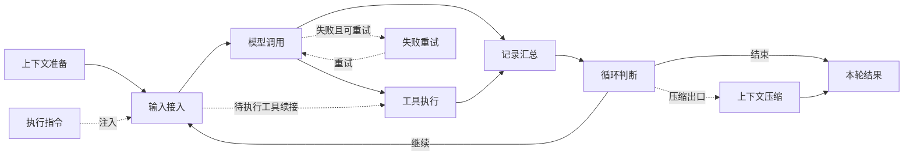

# 主 Agent 运行流程图需求

状态：待实施。所属任务与进度见[任务入口](README.md)；代码依据、接口和数据方案见[技术设计](technical-design.md)。本文维护拟实现的产品规则。

## 1. 目标与非目标

新增一个基础运行流程图，回答“主 Agent 由哪些主要环节组成，现在运行到哪里，正在等待什么”。它与消息节点树互补：节点树保存具体内容和完整历史，流程图只表达结构、进度与简要结果。

范围包括主 Agent 的上下文准备、指令接入、Loop、中间件、模型请求、工具批次、重试、子任务派发/回传和压缩边界。子 Agent 的模型调用、工具、重试和内部 Loop 均不进入本图。

本期不包含流程编辑、拖动节点改变执行顺序、全链路性能诊断、逐 token 输出回放、精确耗时分析、Hook 执行追踪、技能/记忆正文查看或管理，以及完整请求与结果详情。

## 2. 展示信息清单

| 区域 | 必须显示 | 不显示 |
| --- | --- | --- |
| 顶栏 | 主 Agent 身份、实时/回放模式、总体状态；回放时显示所选上下文阶段 | 内部 runId、订阅 ID、调试序号 |
| 结构标识 | Loop 与 `Checkpoint > Sense > Retry > Chat` 的真实外到内层级 | 每个内部函数、每个组件类 |
| 主流程 | 当前执行节点、简短阶段文字、当轮已完成节点 | 持久堆积每轮节点的另一棵消息树 |
| 模型节点 | 请求准备/调用中/响应处理中等阶段，必要时简短模型名 | 提示词、思考正文、逐 token 输出、精确计时 |
| 工具区域 | 当前批次每次调用的名称、顺序标识、执行状态、简短结果 | 全部已安装工具、完整参数、日志和工具结果正文 |
| 子任务派发 | 角色名、已派发/等待返回/已返回/失败等边界状态 | 子 Agent 内部节点或连续进度 |
| 资源摘要 | `记忆（N）`、`技能（N）`、`已加载 M` | 每条记忆、所有技能说明、技能正文列表 |
| Hook 标记 | 适用节点上的 `前 Hook` / `后 Hook` | Hook 名称、次数、执行中/成功/失败、时间线 |
| 回放控制 | 播放/暂停、上一步/下一步、进度、速度、阶段选择、返回实时 | 重新执行、自动批准工具、恢复真实 Agent |

缺失数据使用“未知”或省略可选摘要，不能把未知数量写成 0。未开始会话可以展示结构骨架与“未运行”，不能把所有节点预先标为完成。

## 3. 完整可见节点列表

### 3.1 基础节点与条件节点

总计 10 种流程节点，其中 7 种构成基本骨架、3 种按实际参与情况显示。单次工具调用是工具节点下的动态行，不是新增的中间件层。

| ID | 节点名称 | 出现规则 | 最简内容与状态 | 展示形态 |
| --- | --- | --- | --- | --- |
| `context` | 上下文准备 | 固定骨架；首次建立或真实重建时激活 | 构建中/已就绪/已恢复；关联记忆与技能计数 | 文档图标、小型直角节点，资源摘要在邻接文字区 |
| `input` | 输入接入 | 固定骨架；本轮确有输入合入或恢复时激活 | 用户输入/续接/子任务回传；不放正文 | 输入图标、标准节点 |
| `command` | 执行指令 | 本次发送确有内置指令加载与注入 | `/compact` 等名称；加载中/已注入/加载失败 | 附在输入路径上的条件节点；多指令为紧凑列表 |
| `model` | 模型调用 | 固定骨架；只在实际进入 Chat 调用路径时激活 | 准备请求/调用中/响应处理中/已返回/失败 | 模型图标、标准节点；内部换短状态，不拆多节点 |
| `retry` | 失败重试 | 当前阶段确实发生重试时出现 | 重试等待/第几次尝试；上限取实际配置或实现值 | 模型旁的返回支路，重试图标，不展开所有尝试 |
| `tools` | 工具执行 | 固定骨架；无调用时不高亮，不展开空列表 | 批次总数、完成数、每次调用行 | 工具图标的标题节点，下接无卡片边框的调用列表 |
| `checkpoint` | 记录汇总 | 固定骨架；按 Checkpoint 实际汇总与 effect 输出激活 | 汇总中/已提交；不承诺数据库事务已完成 | 记录图标、标准节点 |
| `decision` | 循环判断 | 固定骨架；按真实 Loop 控制结果更新 | 继续下一轮/等待外部返回/结束/达到限制 | 分支图标、标准节点，使用连线表达分支 |
| `compact` | 上下文压缩 | 本轮压缩请求或真实压缩生效时出现 | 已请求/处理中/已生效/未生效 | 连接结束出口的条件节点；模型生成摘要仍高亮模型节点 |
| `outcome` | 本轮结果 | 固定骨架；本轮退出后更新 | 完成/暂停/取消/失败；等待返回不能显示完成 | 终点图标、标准节点；状态决定描边与状态图标 |

图示为展示拓扑，不表示新增执行步骤：



`context` 只表示真实构建/恢复，不在每轮请求前重复“构建系统提示词”。`checkpoint` 的输入侧行为已由 `input` 表示，输出侧行为由记录汇总表示；两者属于同一 Checkpoint 层。

图中结构层级使用一条紧凑的层级文字带或括线：`Loop [Checkpoint [Sense [Retry [Chat]]]]`。使用同级背景线或标注，不嵌套卡片。各流程节点携带所属层；结构容器本身不制造独立运行状态，也不同时把整条洋葱链点亮成多个正在执行的节点。

### 3.2 动态调用行

| 调用类型 | 简称示例 | 展示方式 |
| --- | --- | --- |
| 普通工具 | `read_file`、`write_file` | 工具图标、名称、状态；失败时一行原因摘要 |
| 终端指令 | `execute_command` | 终端图标，执行中/完成/失败；完整命令留在节点树 |
| 技能正文加载 | `skill` | 技能图标与技能名；成功进入当前上下文后更新 `已加载 M` |
| 记忆工具 | `memory_manage` | 记忆图标与操作短名；写入成功不自动改写当前提示词计数 |
| 子 Agent 派发 | `spawn_role · 角色名` | 派发图标；分别表达工具调用结果与子任务返回状态 |
| 用户提问/审批 | 实际工具名 | 原调用行显示“等待回答”或“等待确认”，主 Agent 仍为运行中 |
| MCP 或其他扩展工具 | 实际工具名 | 复用普通调用行；不为每个插件增加结构层 |

### 3.3 明确省略的内容

以下不独立绘制：Provider 适配器、媒体转换、参数解析、安全检查、审批登记、Hook dispatcher、流片段组装、SQL 写入、日志、通知广播、唤醒策略内部队列、每次重试实例、每条记忆、每个技能说明、未参与工具、子 Agent 内部执行。

这些环节如影响当前进度，以所属节点短状态表达，例如“准备请求”“等待确认”。无可靠历史证据的条件环节不在回放中补成已执行路径。

## 4. 状态与高亮

### 4.1 三种状态相互独立

| 对象 | 状态规则 |
| --- | --- |
| 主 Agent 业务状态 | 未运行、运行中、暂停、完成、取消、失败；以既有业务事实为依据 |
| 节点/调用状态 | 未参与、待执行、执行中、已完成、失败、拒绝、取消；等待附着在执行中节点 |
| 回放播放器 | 未播放、播放中、回放已暂停、播放结束；不能覆盖真实 Agent 业务状态 |

等待模型、用户回答、审批或子 Agent 返回，展示“运行中 · 等待某项返回”。显式暂停、park 或恢复后由既有状态判定为暂停，才显示暂停。生成器返回、一次 runId 结束、没有新事件、网络断线都不能单独作为暂停依据。

`yieldTurn` 可结束当前 Loop 调用并等待子任务，但逻辑任务仍可能运行中。子任务返回也可能只被注入、尚未唤醒主 Agent；此时显示已返回但不制造新的模型高亮。

总体状态仅描述所选主 Agent。存在后台子任务不自动把已完成的主流程改为运行中；只有主 Agent 的既有控制事实表明正在等待时才显示对应等待原因。用户中止等出口以实际暂停/终止事实映射，不能按按钮名称猜测是否可恢复。

### 4.2 高亮规则

1. 主流程同一时刻突出一个实际活动节点；父层只弱描边提示所属结构。
2. 工具区域中的活动调用可与其所属工具节点同时突出。正在后台等待的派发使用等待标识，不抢占主流程焦点。
3. 当轮已完成节点保留轻量完成标识；进入下一轮清除上一轮的活动轨迹。资源统计按上下文阶段管理。
4. 快速经过的实时节点不人为延迟 Agent，也不为动画积压旧高亮。可保留弱完成标记；需要逐项观看时用回放。
5. 一次模型失败若将重试，只标记该次失败和重试，不把整个主任务提前设为失败。单个工具或子任务失败也不自动意味着主任务失败。
6. 断线标为连接不可用，停止活动动画；保留最后已知状态并标为未同步。重连取快照后恢复。

## 5. 工具批次与分组

模型流中可以逐步列出已经识别的调用；在该批第一项真正执行前，必须先发布完整批次清单，再逐项更新结果。前端不得等第一项完成后才发现该批还有其他工具。

- 每次调用按调用 ID 独立占一行；同一名称出现两次不能合并。
- 列表默认保持模型提供的顺序，避免跳动；高亮按后端实际执行顺序移动。当前后端先顺序执行自动工具，再逐个审批并执行需审批工具。
- 同一批次内已完成项保留，直到下一批次开始；无需累积所有历史工具。
- 未完成的子任务派发在批次结束后移入工具区域的“待返回”紧凑行，直到返回或真实终结，不带出子树。
- 普通工具仅展示当前批次；记忆和技能只展示摘要统计。先前“逐条列出参与过的记忆/技能”的讨论不再采用。
- 默认最多显示 3 个调用行，工具列表内部滚动查看其余项，标题显示总数与完成数。所有本批调用进入列表数据，不能只给一个“还有 N 个”且无访问途径。
- 新结果不改变节点尺寸。列表有用户手动滚动时不抢滚动；提供小型“定位当前”图标，允许在本图内定位活动调用。
- 结果默认显示完成/拒绝/失败等语义。只有现成结构化结果提供明确短摘要时才附加，最多一行；超长文本省略，完整内容仍归节点树。

“派发成功”只说明派发工具完成，不能显示成“子任务完成”。同步等待时显示“已派发 · 等待返回”，异步派发后主 Agent 可继续其他节点；子任务结束、回传入主上下文、唤醒主 Agent 分别按已有事实更新，不推演其内部过程。

## 6. 记忆、技能与上下文边界

### 6.1 计数口径

| 摘要 | 含义 | 更新时机 |
| --- | --- | --- |
| `记忆（N）` | 实际生效系统提示词注入的全局与工作区活跃记忆索引条数 | 首次构建或实际替换系统提示词时 |
| `技能（N）` | 实际生效系统提示词中经过角色过滤的技能发现信息数量 | 同上 |
| `已加载 M` | 当前有效消息上下文中，通过技能加载路径成功载入正文的去重技能数 | 正文成功载入、相关消息撤回/替换、压缩或真实上下文重建时重新核对 |

元数据存在不等于正文已加载；名称出现在压缩摘要中也不等于正文仍在。技能加载错误、被拒绝或被取消不增加 M。现有角色过滤只控制发现信息，不能假定 M 必然小于等于 N。

本期不从任意 `read_file` 文本猜测它是否加载了技能；计数覆盖系统能确定的技能正文加载路径。旧历史无法证明成功加载时显示未知或已确认数量并标为不完整，不推断完整值。

### 6.2 压缩成功后

压缩不是新建 chatId，也不是创建新 Agent；实际效果是保留系统提示词与最近压缩摘要，裁剪此前有效消息。系统提示词中的记忆和技能说明保留，旧工具结果中的技能正文不再进入上下文。

只有实际裁剪生效后才切换“上下文阶段”：清除此前动态参与记录、工具批次和高亮，正文加载数重新计算，正常情况下归零；固定结构骨架与仍生效的提示词摘要保留。触发压缩通知、点击压缩、请求里有 `/compact`、生成了尚未应用的摘要，都不足以切阶段。

```text
压缩前：记忆（8）  技能（12）  已加载 3
压缩后：记忆（8）  技能（12）  已加载 0
```

回放默认选择最近成功压缩后的阶段，允许选择之前阶段。压缩动作的步骤保留在它发生的旧阶段末尾，新阶段从压缩生效后开始；当前图可以短暂显示“已生效”，但不能让新阶段继续携带旧调用列表。

冷恢复加载最近摘要与其后的消息，必须恢复摘要之后新载入的技能，不能每次刷新一律把 M 置 0。配置纪元切换可能更换提示词但保留消息，不应机械套用“压缩清空”规则。

## 7. Hook 展示

Hook 仅作为节点的挂载标记。示例为节点边缘的小型 `前 Hook`、`后 Hook` 文字与连接点；占用预留行位，没有标记时保留节点尺寸。

| 所属节点 | 前标记来源 | 后标记来源 |
| --- | --- | --- |
| 模型调用 | 已接线的 `UserPromptSubmit`；当前 Provider 确实支持的 `PreLLMRequest` | `PostLLMResponse`、实际适用的 `Stop` |
| 每次工具调用 | `PreToolUse` | `PostToolUse` |

同一位置有多个 Hook 时仍只显示一个位置标记。只判断已生效注册表、实际接线及目标匹配关系，不执行 handler 来判断标记；带运行时 `if` 的配置仍属于条件挂载，标记不承诺该次命中。

尚为 stub 的生命周期或压缩 Hook 不显示成有效挂载。未知历史配置不拿今天的 Hook 配置补回过去；历史没有可靠挂载信息时省略。无需记录“具体执行哪个 Hook”，也不新增 Hook 事件持久化。

## 8. 节点视觉规格

所有新增元素遵循[前端视觉规范](../../standards/frontend/ui-visual-and-interaction.md)：直角、正文与状态字重 400、标题至多 600、中文不小于 12px，颜色使用项目语义 token。沿用现有图标库，按钮带可读标签或 tooltip。

- 标准节点建议宽 112 至 144px、高 56px，图标 16px。节点名与短状态各一行，Hook 使用固定的附着位置；长名称保留名称 tooltip。
- 竖向图节点宽度随 320px 栏内可用宽度伸展，高度保持一致。动态工具行高 28px，派发状态最多两行时使用预先确定的 44px 行高。
- 工具调用列表是紧凑行，资源是邻接计数字段；不要在节点卡片里再嵌套卡片。
- 未参与：弱文字与轮廓；执行中：主题强调描边加活动图标；完成：成功图标；等待：执行中颜色加等待图标与原因；失败/拒绝：错误或警示图标与短语。
- 暂停、取消、未知各有文字/图标区别，不能只靠颜色。回放暂停使用播放器状态，不改变节点的历史业务状态。
- 连线只表达基础顺序与条件返回，不做逐 token 粒子动画。遵守减少动效偏好；状态切换不改变布局。
- 点击流程节点不新开完整详情。必要的名称说明通过 tooltip，实际消息内容继续在节点树查看。

## 9. 空间分配与模式组合

### 9.1 入口与总体原则

右侧工具栏增加“运行流程”图标按钮，有按下状态与 tooltip。初次打开工作台默认关闭；新建或重新打开窗口不自动开启实时观察。打开后订阅当前主 Agent，关闭只释放本窗口流程图订阅。

流程图开关与 `paperMode`、树方向、折叠方式独立，不互斥。已有偏好继续控制树；本期开关不新增全局常驻追踪配置。

### 9.2 水平树：上下布局

```text
工作台标题与原有工具栏
--------------------------------------------------
运行流程：横向主路径，内部可横向滚动
--------------------------------------------------
消息节点树：保留水平排版及自己的相机
--------------------------------------------------
输入区域：展开时预留空间
```

默认流程图在上、节点树在下。本期不增加上下位置切换和分隔条拖拽，减少偏好与布局状态。

以下是待实现的尺寸预算，不是已经做过实机验证的结果。`H` 为扣除工作台标题、已展开输入区及必要安全间距后的内容高度：

| 分配项 | 预算与行为 |
| --- | --- |
| 流程区高度 | `clamp(232px, H * 0.28, 300px)` |
| 流程区内部 | 控制行 36px、结构/资源信息带 24px、图形净高至少 160px，其余为间距 |
| 消息树净高 | 剩余空间，最小 240px |
| 两区分隔 | 8px，包括分割线与间距 |
| 总高度不足 | 内容区纵向滚动，保留 232 + 8 + 240 = 480px 最小内容高，不继续压小文字与节点 |
| 横向主图 | 最小逻辑宽约 960px；不足时只滚动流程图，不横向挤压消息树 |

232px 的下限用于容纳紧凑控制、基础路径和三个工具行，比此前仅供讨论的 160px 预算更完整。条件节点使用主路径邻接轨道，超过图形净高的部分在图内滚动，不能持续挤占消息树。

示例：内容 H=800px 时流程区 232px、间隔 8px、树 560px；H=600px 时树 360px；H=440px 时内容溢出 40px，允许纵向滚动。模式切换只改变区域尺寸，不重算树的语义拓扑或重置树相机。

### 9.3 竖直树与卡片：三栏布局

```text
卡片区                     消息节点树              运行流程
既有卡片与选择             保留竖直排版            竖向基础路径
独立内容与滚动             独立 Pixi 相机          独立滚动
```

当前卡片模式与竖向展示有关联，按现有 `paperMode` 派生关系处理。将来或降级路径没有卡片时，左侧卡片轨道不占空列，使用“竖直树 | 流程”两栏；流程开关本身不强制启用卡片。

| 项目 | 最小值/默认分配 |
| --- | --- |
| 卡片轨道 | 460px |
| 消息树轨道 | 420px |
| 流程轨道 | 320px，默认固定宽度，内部纵向滚动 |
| 两个栏间间距 | 各 12px |
| 右工具栏与安全空间 | 预算 64px；实际按宿主容器计算，不能重复扣减 |
| 三栏内容最小宽度 | 1224px，不含工具栏安全空间 |
| 建议工作台净宽 | 1288px，可完整容纳上述三栏与安全空间 |
| 更宽时分配 | 超出 1288px 的剩余宽度按卡片 40%、树 60% 分配，流程仍为 320px |

这是新三栏模式的可读性下限，不是声称现有卡片已经有 460px 下限。现有卡片绝对定位与树的百分比宽度必须调整为同一组轨道尺寸，避免先缩整个树组件，再在组件内按 50% 二次缩窄卡片。

窗口不足时保留三栏，用内容区域横向滚动；不自动关流程、不切回横向树、不把卡片叠到流程上。工具栏与窗口关闭入口固定在可见宿主范围，首次打开流程时只允许滚动外层内容让流程栏可见，不移动树相机、不改变卡片选择。

例如工作台净宽 1440px 时有 152px 剩余可分配；1280px 时约溢出 8px；1024px 时约溢出 264px；720px 时约溢出 568px。依据的是工作台尺寸，不能直接拿屏幕分辨率当窗口尺寸；默认窗口约占屏幕 82% 时，即使 1366px 屏幕也可能需要横向滚动。

### 9.4 输入框、浮层与尺寸变化

- 流程开启时，已展开输入框使用底部保留区，图与树按其实际高度缩减可用 H；输入区隐藏时释放空间。输入框保持原有发送与分支语义。
- 输入框过高使用自身内容滚动；不能覆盖流程当前节点、回放控制或卡片操作。
- 标题栏、工具栏、既有上下文用量条沿用宿主定位，避开流程控制行；不能把原浮层固定坐标直接套到新的三栏内容坐标。
- 两幅图独立缩放/定位；新增图默认原生滚动，不实现编辑器级相机。树内平移、流程滚动、卡片翻页不得相互触发。
- 打开/关闭流程和切换方向允许重新分配容器尺寸；高亮、结果、Hook 标记和资源数字更新不触发布局重排或自动 fit。
- 工作台最小化时停止前端动画与绘制，观察订阅可保留；关闭窗口或切换会话必须释放旧订阅。
- 小屏允许内容双向滚动，以可读性优先；不能用缩小到低于 12px 的办法强塞全部区域。

## 10. 实时观察与回放

### 10.1 实时观察

打开流程图才注册观察者，关闭不影响真实 Agent 执行与其他窗口。只读历史会话仍能看结构与回放，但不能借此创建可执行 runtime 或恢复归档会话。

中途打开先显示当前快照。未观察期间缺少内部短阶段时，允许显示“运行中”并等待下一次真实边界；模型/工具/等待状态能从既有事实确认时应立即恢复。不得为补齐视觉路径而伪造已经观察到的节点序列。

### 10.2 回放

回放是前端对已确认结果进行顺序动画。默认不按真实耗时等待，基础步长 700ms，速度 0.5x、1x、2x、4x；等待阶段最多占一个普通步骤，不停留数分钟。

- 默认范围是当前主会话最近成功压缩后的上下文阶段；菜单可选择以前阶段，不加载子 Agent 内部历史。
- 一次模型调用、一个工具批次清单、每次工具开始/结果、主 Agent 派发/回传、真实暂停/恢复/终态和压缩生效构成主要步骤。
- 阶段可跨多个 runId。没有证据的重试或内部准备步骤省略；展示数据缺失时说明“部分步骤不可还原”。
- 历史结果先归并出完整批次，再按记录确认的顺序回放。只保留结果、无法确定严格执行先后的旧批次可以确定性顺序展示，但不得声称为真实时间顺序。
- 播放/暂停、前进/后退、进度定位均只操作前端播放器。任何动作都不能调用发送、恢复、审批、终止等业务接口。
- 进入回放固定当前历史边界，新的实时数据更新独立缓存，不挤入正在播放的步骤。返回实时立即使用最新快照。
- 暂停回放、选择历史阶段不会改变消息树方向、卡片选择和真实 Agent 状态。
- 长期历史仍可回放；不依赖 24 小时事件日志。大阶段通过现有分页加载，分页未到达末尾不显示“回放已完成”。

## 11. 验收要求

| 编号 | 可判定结果 |
| --- | --- |
| R01 | 默认关闭；打开观察主 Agent，关闭释放本窗口订阅，Agent 继续运行 |
| R02 | 展示本说明中的 10 类节点规则，无子 Agent 内部图、Hook 独立节点或完整详情 |
| R03 | 等模型、审批、回答、子返回均显示运行中；真实暂停与正常完成可区分 |
| R04 | 本批调用先完整列出，再逐项更新；重复工具不合并，执行顺序遵从事实 |
| R05 | 派发成功不等于子任务成功；子返回未唤醒时不冒出模型活动 |
| R06 | Hook 只显示前/后挂载标记；无 handler 名称、状态或执行日志 |
| R07 | 记忆/技能只有计数，技能正文加载按成功结果去重；旧数据缺失不伪造 0 |
| R08 | 压缩生效才重置动态参与；固定骨架和保留提示词摘要仍在；冷恢复不丢压缩后技能 |
| R09 | 水平树上下布局；卡片竖直树三栏；小窗滚动且字可读，输入区不遮挡 |
| R10 | 状态更新不改变树相机、排版和卡片选择；两幅图交互独立 |
| R11 | 断线、重复消息、多窗口和会话切换不串状态；关闭观察不干扰原订阅 |
| R12 | 回放只播放主 Agent 的粗粒度流程，控制无业务副作用，旧历史不依赖短期日志 |
| R13 | 不新增持久追踪表，不改变现有消息保留和日志清理行为，不保存完整流式输出 |

自动验证入口和最后的人工验收归[任务入口](README.md)管理，本文不记录尚未执行的通过结论。
